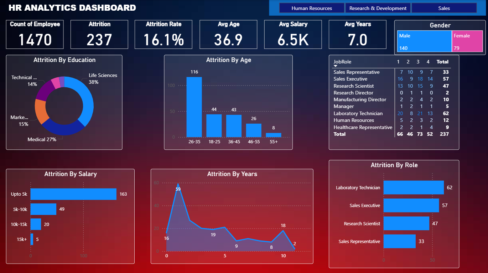

# HR Analytics Dashboard 📊

An interactive HR Analytics dashboard built in Power BI to track and visualize key workforce metrics including attrition, department-wise headcount, and employee demographics.

## Dashboard Preview

## Key Metrics Tracked
- Employee attrition rate by department and age group
- Headcount distribution across departments
- Salary vs. job role analysis
- Education field vs. attrition correlation

## Files
- `HR Analytics Dashboard.pbit` — Power BI template file (open with Power BI Desktop)
- `pbi.png` — Dashboard screenshot

## Tools Used
`Power BI` `Data Modelling` `DAX` `Interactive Dashboards` `Data Visualization`
